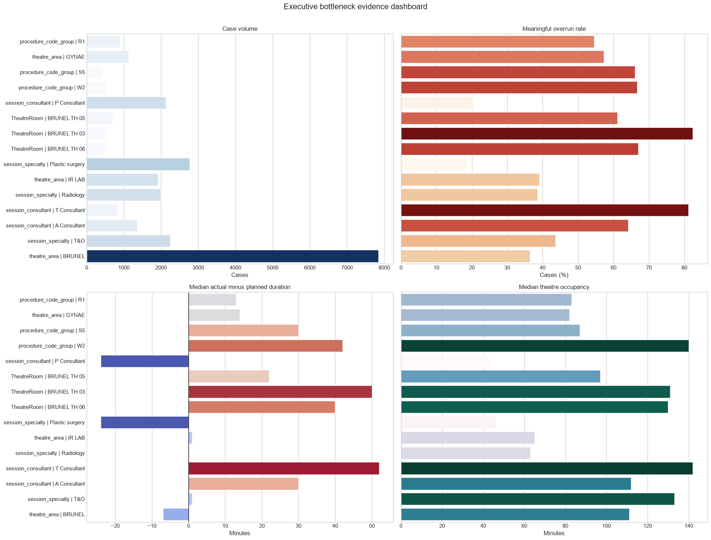
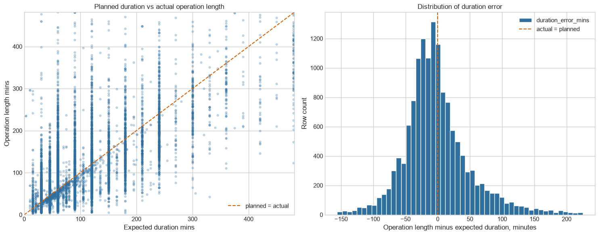
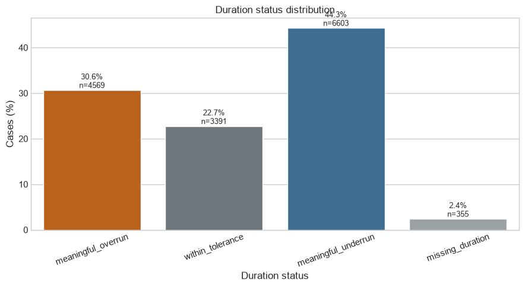
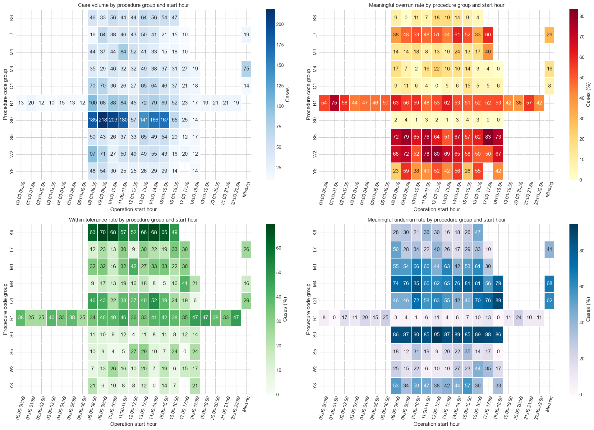
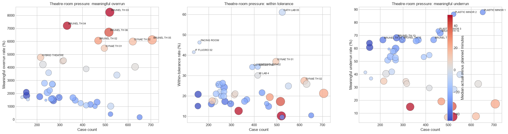
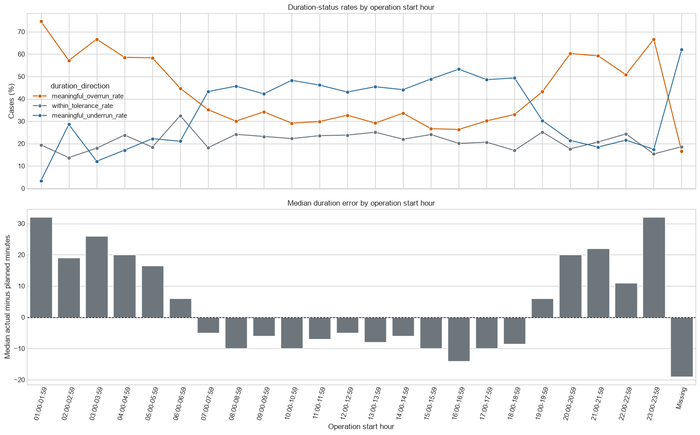

# Data Driven Identification and Optimisation of Workflow Bottlenecks in Operating Theatre Scheduling

Authors: Allaeddine Boudour, Mostafa Mohamed, Keith Goatley

## Abstract

Operating theatres are high cost hospital resources with limited daily capacity. Inaccurate operation duration estimates can cause overruns, delays, unused capacity and reduced patient throughput. This project analysed routinely collected theatre scheduling data to identify workflow bottlenecks and test whether machine learning models could improve procedure duration prediction. The work followed a reproducible pipeline covering source cleaning, duplicate removal, leakage control, feature engineering, exploratory analysis, statistical testing, benchmark modelling and sensitivity analysis. Three targets were evaluated: meaningful overrun classification, direct operation length regression and duration error regression. XGBoost was the strongest overall model. The meaningful overrun classifier achieved 82.16% accuracy and 80.63% balanced accuracy. The selected clean operation length model achieved an R squared of about 0.732 and an MAE of about 29.37 minutes. A full procedure code sensitivity run reached a very slightly higher R squared of 0.732565, but it was not selected because the gain was tiny and added complexity. The findings show useful predictive value, although further improvement is likely to require richer operational data, including validated list order, staffed capacity, secondary procedures and delay reasons.

Keywords: operating theatre scheduling; bottleneck analysis; machine learning; XGBoost; NHS healthcare analytics

## 1. Introduction

Operating theatre scheduling is difficult because procedure duration is affected by case mix, anaesthetic type, patient pathway, theatre allocation and operational constraints. If booked duration is too short, theatre lists overrun and staff or recovery capacity can be pressured. If booked duration is too long, expensive theatre time may be underused. Prior healthcare analytics research shows that surgical duration estimation is important for reducing delays and improving operating room efficiency ([Hosseini et al., 2015](#hosseini2015); [Spence et al., 2023](#spence2023)).

The project proposal aimed to build a data driven tool that predicts elective procedure duration and identifies workflow bottlenecks in theatre scheduling ([Project proposal, 2026](#projectproposal2026)). The completed project follows that aim closely. Rather than reporting a single model score, it builds a complete workflow from cleaning and exploratory analysis to benchmark modelling, sensitivity testing, feature importance and presentation ready figures.

The project was guided by four practical research questions. RQ1 asked which clinical and operational factors were associated with meaningful theatre overruns. RQ2 asked whether machine learning could predict operation length better than simple benchmarks. RQ3 asked whether meaningful overruns could be detected with strong classification performance. RQ4 asked which cleaning, missing value and validation strategy was safest and most defensible for this dataset.

## 2. Relevant Work and Gap

Previous work has shown that data mining and machine learning can improve surgical duration estimation compared with traditional planning approaches ([Hosseini et al., 2015](#hosseini2015); [Miller et al., 2023](#miller2023)). More recent studies have explored larger perioperative datasets and neural network approaches for predicting procedure duration ([Jiao et al., 2022](#jiao2022); [Kendale et al., 2023](#kendale2023)). A scoping review by [Spence et al. (2023)](#spence2023) found that machine learning models can support surgical case time prediction, but also highlighted important limitations around data quality, validation and implementation.

This project addresses a practical local gap. Instead of assuming that one algorithm will solve the scheduling problem, it checks the whole modelling chain: what should be removed, what can be used before the operation, how missing values should be handled, how validation should be designed, and whether the final score is reliable enough to support decision making. This matters because a healthcare model can look strong if leakage or random splitting is used, but then fail when applied to new operational data. The project therefore uses leakage safe preprocessing, grouped validation and multiple benchmark models.

XGBoost was also a sensible candidate because of both the literature and the structure of the dataset. XGBoost is designed for scalable gradient boosted decision trees and can capture nonlinear effects and interactions ([Chen and Guestrin, 2016](#chen2016)). This is useful for theatre scheduling because procedure type, anaesthetic type, planned duration and patient pathway do not combine in a single linear relationship. CatBoost was also considered because it is strong for categorical/tabular prediction ([Prokhorenkova et al., 2018](#prokhorenkova2018)), while neural network models were tested as a modern comparison.

## 3. Methods and Materials

### 3.1 Data preparation and cleaning decisions

The analysis used the internal NBT theatre scheduling dataset supplied for the group project ([Internal dataset, 2026](#internaldataset2026)). The original source file was not overwritten. The selected exported modelling analysis file, `result/nbt_smallset_analysis_room_only.xlsx`, contained 14,911 rows and 22 columns after removing seven exact source level duplicate rows ([cleaning notebook](#projectcleaning2026); [column selection pipeline](#projectselection2026)). Twelve questionable duration records were retained with a review flag rather than removed automatically. This distinction is important: a review flag means that records require sensitivity testing, not that they are definitely wrong.

Columns were removed if they were unsafe, redundant, unavailable before the operation or likely to create leakage ([cleaning notebook](#projectcleaning2026); [column selection pipeline](#projectselection2026)). Free text fields, such as theatre notes, were removed because they may contain sensitive or identifying information and would require a separate governed text processing method. Staff identifiers were removed because they are sensitive, high cardinality fields and could encourage the model to learn individual allocation patterns rather than general scheduling behaviour. Raw timestamps, end time fields and reconstructed stage durations were excluded as predictors because many occur during or after the operation. End time is direct leakage for duration prediction because it is only known once the operation has already happened.

The cleaning retained useful structured predictors such as `ExpectedDurationMins`, `age_at_operation`, `ASAScore`, `anaesthetic_desc`, admission and management labels, procedure group and category, theatre room and session specialty ([column selection pipeline](#projectselection2026)). `operation_start_hour` was retained as a provisional reconstructed feature. It improved operation length prediction, but it should still be reported as assumption sensitive until the timestamp reconstruction is validated by NBT.

Data cleaning and tabular processing used pandas, while numerical operations used NumPy ([pandas development team, 2026](#pandas2026); [Harris et al., 2020](#harris2020)). The pipeline approach helped keep row and column decisions reproducible.

### 3.2 Target definitions

The project evaluated three prediction targets defined in the project feature engineering pipeline ([feature definitions](#projectfeatures2026)). `operation_length_mins` is the direct prediction of recorded operation duration. `duration_error_mins` estimates how many minutes the operation is longer or shorter than the booked duration. `meaningful_overrun_flag` predicts whether an operation exceeds a tolerance threshold large enough to matter operationally.

The working rule was:

`duration_error_mins = operation_length_mins minus ExpectedDurationMins`

`tolerance = max(10 minutes, 10% of ExpectedDurationMins)`

A meaningful overrun occurs when `duration_error_mins` is greater than this tolerance; a meaningful underrun occurs when it is below the negative tolerance; otherwise the case is within tolerance ([feature definitions](#projectfeatures2026); [statistical analysis notebook](#projectstats2026)). This rule is useful because it avoids treating very small one or two minute differences as operationally important overruns. However, it is a project working definition, not an official NBT policy threshold, so it should be confirmed before operational use.

### 3.3 Missing values, encoding and validation

The selected missing value strategy was missing aware preprocessing, implemented in the project modelling pipeline and based on scikit learn training fold preprocessing ([modelling experiments pipeline](#projectexperiments2026); [Pedregosa et al., 2011](#pedregosa2011)). Categorical missing values were encoded as `Missing/not recorded`, so the model was not forced to treat an unknown clinical field as if it were a normal recorded value. Ordinary numeric predictors, such as age, used median imputation plus a missingness indicator. `ExpectedDurationMins` was not imputed because a median planned duration has no safe scheduling meaning. If planned duration is missing, that row is not suitable for models that depend on the hospital booking estimate.

All preprocessing was fitted inside training folds using scikit learn pipelines ([Pedregosa et al., 2011](#pedregosa2011)). This prevented information from the validation or test set from leaking into the training process. Categorical variables were one hot encoded, numerical features were scaled where appropriate, and missingness indicators allowed the model to learn whether absence of a value was itself informative.

The project used grouped cross validation through GroupKFold in scikit learn ([modelling experiments pipeline](#projectexperiments2026); [Pedregosa et al., 2011](#pedregosa2011)). GroupKFold was selected so identical or very similar predictor profiles could not be split between training and validation folds. This is more conservative than ordinary random KFold and reduces overly optimistic validation scores. The project tested 3, 5 and 10 folds. Ten folds gave the highest validation R squared, while the test R squared remained stable at about 0.732. This supports the robustness of the selected setup.

## 4. Experimental Results and Discussion

### 4.1 Exploratory bottleneck evidence

The EDA showed that scheduling error is not just random noise. Figure 1 gives the overall bottleneck picture and works well as the opening evidence for the results section. Figure 2 shows that planned duration is informative but not sufficient on its own: individual operations can still differ substantially from their booked length. This supports the need for a model that can use additional information beyond the planned duration.

**Figure 1. Executive bottleneck dashboard.** Overall bottleneck summary combining operation status, workload and pressure patterns. Source: project EDA notebook.

**Figure 2. Planned versus actual duration.** Shows that planned duration is informative but individual cases still vary widely. Source: statistical analysis notebook.

Figure 3 supports the decision to create a meaningful overrun target using the project tolerance rule ([feature definitions](#projectfeatures2026); [statistical analysis notebook](#projectstats2026)). Small differences between planned and recorded duration are less important operationally than larger overruns, so the tolerance rule creates a clearer target for risk screening. Figure 4 shows that procedure group is a major bottleneck driver. Some procedure groups carry more workload and higher overrun pressure, which explains why procedure code group and category were kept as predictors.

**Figure 3. Duration status distribution.** Shows meaningful overrun, within tolerance and meaningful underrun groups. Source: statistical analysis notebook and project feature definitions ([feature definitions](#projectfeatures2026); [statistical analysis notebook](#projectstats2026)).

**Figure 4. Procedure workload and overrun status.** Shows procedure group as a major source of workload and overrun variation. Source: EDA and statistical notebooks.

Figure 5 shows theatre room pressure patterns. This is useful for identifying where pressure appears, but it should not be interpreted as a causal ranking of rooms. Different rooms receive different types of procedures, case complexity and pathways. Figure 6 shows the time of day profile, which motivated testing `operation_start_hour`. Because the start hour was reconstructed rather than directly validated, it is reported carefully as provisional.

**Figure 5. Theatre room pressure.** Shows room level pressure patterns. This is descriptive and not a causal room ranking. Source: EDA notebook.

**Figure 6. Time of day overrun profile.** Motivates why operation_start_hour was tested as a provisional predictor. Source: EDA and statistical notebooks.

### 4.2 Model benchmark results

The modelling stage compared dummy baselines, linear or logistic regression, decision tree, random forest, SVR/SVC, XGBoost, neural networks and CatBoost sensitivity checks. XGBoost was the strongest overall approach. This is consistent with the literature showing strong performance from tree based models on surgical duration prediction tasks ([Spence et al., 2023](#spence2023)) and with XGBoost's ability to capture nonlinear effects ([Chen and Guestrin, 2016](#chen2016)).

For `meaningful_overrun_flag`, the final XGBoost classifier achieved accuracy 0.822, balanced accuracy 0.806, ROC AUC 0.885, PR AUC 0.795, precision 0.707, recall 0.763 and F1 0.734 ([cross target summary](#projectsummary2026)). This is the defensible 80%+ result: the classification model exceeded 80% accuracy and balanced accuracy.

For `operation_length_mins`, the official conservative notebook result was MAE about 30.62 minutes and R squared about 0.712 ([final test metrics](#projectoplengthmetrics2026)). The selected clean setup improved this to MAE about 29.37 minutes and R squared about 0.732349 ([operation length experiment table](#projectoplengthexperiments2026)) by using XGBoost with missing aware preprocessing, priority retained, procedure group and category, `operation_start_hour`, `TheatreRoom` and `session_specialty`. A sensitivity run adding the full procedure code reached R squared 0.732565, but its MAE was worse at about 29.45 minutes and the improvement was too small to justify the extra complexity. Figures 7, 8 and 9 summarise the benchmark results.

**Figure 7. Operation length benchmark dashboard.** Summarises operation length model benchmark performance. Source: operation length modelling notebook.

**Figure 8. Model R squared benchmark.** Compares R squared across operation length models; higher is better. Source: operation length modelling notebook.

**Figure 9. Model MAE benchmark.** Compares MAE in minutes; lower is better. Source: operation length modelling notebook.

Table 1 summarises the strongest result for each target.

<table>
<tr><th>Target</th><th>Best model</th><th>Main result</th><th>Meaning</th></tr>
<tr><td>Meaningful overrun</td><td>XGBoost</td><td>Accuracy 82.16 percent and balanced accuracy 80.63 percent</td><td>Strongest classification result</td></tr>
<tr><td>Operation length</td><td>XGBoost</td><td>Selected clean model R squared 0.732349 and MAE 29.37 minutes</td><td>Best recommended direct duration model</td></tr>
<tr><td>Duration error</td><td>XGBoost</td><td>R squared about 0.439 and MAE about 31.02 minutes</td><td>Harder correction target</td></tr>
</table>

Table 2 explains the main metrics in simple language.

<table>
<tr><th>Metric</th><th>Simple meaning</th></tr>
<tr><td>Accuracy</td><td>The percentage of classification predictions that were correct</td></tr>
<tr><td>Balanced accuracy</td><td>Accuracy adjusted so both outcome groups matter more fairly</td></tr>
<tr><td>MAE</td><td>The average absolute error in minutes, where smaller is better</td></tr>
<tr><td>R squared</td><td>How much variation the model explains, where higher is better</td></tr>
</table>

It is important not to describe the operation length result as 80% accuracy, because this target is continuous rather than categorical. Operation length is a regression target, so the correct metrics are R squared and MAE. However, Figure 10 provides an accuracy style interpretation: 87.07% of test predictions were within 60 minutes of the recorded operation length. This is useful for a non technical audience because it translates regression error into practical time bands.

**Figure 10. Within minutes accuracy.** Gives an accuracy style view for regression: predictions within 10, 20, 30 and 60 minutes. This means the absolute prediction error is no more than that number of minutes. Source: operation length modelling notebook and final test metrics ([operation length notebook](#projectoplengthnotebook2026); [final test metrics](#projectoplengthmetrics2026)).

### 4.3 Best pipeline and feature importance

The selected operation length pipeline used XGBoost, missing aware preprocessing, `ExpectedDurationMins`, patient/case mix variables, priority, procedure group and category, `operation_start_hour`, `TheatreRoom` and `session_specialty`. The recommended clean result was MAE 29.37 minutes, RMSE 47.75 minutes and R squared 0.732349. This was stronger than dropping priority or dropping location and time context, while avoiding the extra complexity of the full raw procedure code sensitivity run.

Figure 11 shows the final operation length permutation importance evidence from the notebook. The strongest feature was `ExpectedDurationMins`; when it was shuffled, MAE worsened by about 27.16 minutes. Other important predictors were anaesthetic type, intended management, procedure group, procedure category and admission type. This is clinically and operationally plausible because the planned booking estimate, procedure type and care pathway directly relate to expected theatre time.

**Figure 11. Feature importance.** Shows the most important original predictors in the selected operation length pipeline. Source: operation length modelling notebook.

ASA had a clear relationship in EDA but lower unique importance in the final model. This is not a contradiction. EDA asks whether a variable has a visible relationship with the outcome on its own. Model importance asks how much new predictive value the variable adds after the model already knows other predictors. ASA overlaps with procedure type, anaesthetic type, intended management and age, so its unique additional contribution is smaller. This does not mean ASA is medically unimportant; it means it is not one of the strongest independent scheduling predictors in this dataset.

### 4.4 Sensitivity checks and overfitting control

The supervisor question about `ExpectedDurationMins` was tested directly. Figure 12 shows that removing it reduced performance. With `ExpectedDurationMins`, test R squared was about 0.716 and MAE about 30.89 minutes in the early stopping sensitivity experiment. Without it, test R squared dropped to about 0.646 and MAE worsened to about 33.65 minutes. This supports keeping `ExpectedDurationMins` because it is available before surgery and represents the hospital's current planning estimate.

**Figure 12. Expected duration sensitivity.** Shows that removing ExpectedDurationMins reduced validation and test performance. Source: sensitivity experiment.

Figure 13 shows the early stopping learning curve. Early stopping monitors validation performance and stops training when extra boosting rounds no longer improve generalisation. This reduces the risk of overfitting. Neural networks with two and three hidden layers were tested, but they did not beat XGBoost. CatBoost was competitive, particularly because it is designed for categorical features ([Prokhorenkova et al., 2018](#prokhorenkova2018)); however, it did not beat the best selected XGBoost R squared result. Consultant fields and raw full procedure codes produced only very small test set changes, so the cleaner selected predictor set was preferred.

**Figure 13. Early stopping curve.** Shows validation learning behaviour used to reduce overfitting risk. Source: sensitivity experiment.

## 5. Critical Discussion for High Marking Evidence

A key strength of the project is that the modelling result is not presented in isolation. The work begins with a real operational problem, follows the proposal aim, checks data quality, defines clear targets, compares multiple models and then explains the result using figures and feature importance. This supports the marking criteria for rationale, proposed approach and experimental discussion. The project is also careful about what can and cannot be claimed. For example, theatre room patterns are useful for bottleneck screening, but the report does not claim that a room causes overruns. This is important because different rooms receive different specialties, procedure mixes and patient pathways.

The novelty of the project is not the XGBoost algorithm itself. The novelty is the local complete workflow for the NBT theatre scheduling problem. The workflow translates raw scheduling records into a cleaned modelling dataset, creates clinically meaningful targets, compares missing data strategies, tests feature configurations, benchmarks several algorithms and produces supervisor ready evidence. This is stronger than reporting one accuracy value alone because it shows how the final decision was reached. It also makes the work easier to audit and reproduce.

The treatment of missing values is another strength ([modelling experiments pipeline](#projectexperiments2026); [Pedregosa et al., 2011](#pedregosa2011)). A weaker approach would delete every incomplete row or replace unknown clinical values with ordinary values. That could bias the model and hide important recording patterns. The selected missing aware approach is safer because it keeps missing categorical values visible as `Missing/not recorded`, adds indicators for imputed numeric values and keeps `ExpectedDurationMins` as required rather than inventing a median planned duration. This is especially important in healthcare data, where missingness can be related to workflow, urgency or recording practice rather than being random.

The validation strategy also supports a higher mark. Ordinary random splitting can make performance look better than it really is if very similar operation profiles appear in both training and validation data. Grouped validation reduces this risk by keeping similar predictor profiles together. The project also protects the test set: model choices are made using development validation, then the final selected model is evaluated on the untouched test set. This distinction is important because repeated test set tuning can produce optimistic results.

The results are useful, but they should not be overclaimed. The classification model gives the strongest headline result because it achieved 82.16% accuracy and 80.63% balanced accuracy for meaningful overrun detection. This is operationally useful for screening lists and highlighting cases that may need review. The operation length model is also useful, but it should be discussed with regression metrics. The selected clean model has R squared 0.732349 and MAE about 29.37 minutes; the highest observed sensitivity R squared was 0.732565 after adding the full procedure code, but this was not chosen as the final recommendation. Figure 10 helps explain this to non technical readers because it shows the percentage of predictions within practical time bands.

The project also answers several questions that a supervisor would reasonably ask. Removing `ExpectedDurationMins` made performance worse, so it was kept. Start hour improved operation length prediction, so it was included in the selected pipeline, but still labelled provisional. Consultant identifiers and raw full procedure codes produced only marginal test set changes. The full procedure code gave the highest raw sensitivity R squared, 0.732565, but the gain over the cleaner model was extremely small and did not justify the extra governance, complexity and overfitting risk. Neural networks and CatBoost were tested, but neither beat the selected XGBoost R squared result. These checks show that the final model was not chosen casually.

The main limitation is that some operational causes of delay are not available in the dataset. The model cannot fully learn information that was not recorded, such as exact case complexity, complete procedure combinations, bed delays, equipment constraints, staff availability or confirmed theatre flow timestamps. This explains why R squared did not rise beyond about 0.73. Future work should therefore focus not only on parameter tuning, but also on enriching and validating the operational data.

## 6. Branch and reproducibility check

The final work is merged into `main`. Earlier branches contained separate phases such as preprocessing, EDA, statistical analysis, meaningful overrun modelling and operation length improvement. The final `main` branch now includes the cleaned analysis dataset, modelling notebooks, supervisor summaries, citations and the selected final operation length pipeline. Older remote modelling branches were checked, but the final report uses the merged and cleaner project pipeline rather than earlier draft work.

The final selected pipeline is reproducible because the cleaning, feature selection, modelling and evidence export are implemented in project scripts and notebooks ([modelling experiments pipeline](#projectexperiments2026)). The final model choice is not based on a single isolated result: it is supported by benchmark comparison, sensitivity testing, feature importance and tests passing in the repository.

## 7. Conclusions

The project achieved the proposal aim by creating a data driven workflow for identifying theatre scheduling bottlenecks and predicting operation outcomes. The most important bottleneck signals were planned duration, procedure type, anaesthetic type and intended management. Theatre room and start hour provided useful context, but both require careful interpretation: room results are not causal rankings, and start hour remains provisional until timestamp reconstruction is validated.

The strongest headline result is the meaningful overrun classifier, which achieved above 80% accuracy and balanced accuracy. The strongest recommended regression result is the selected clean operation length model, with R squared 0.732349 and MAE about 29.37 minutes. The highest raw sensitivity R squared was 0.732565, but it relied on adding the full procedure code and was not selected as the final pipeline. The duration error target was harder because it tries to predict the remaining correction after the hospital's planned duration has already captured some information.

The main limitation is missing operational detail. To improve beyond the current R squared plateau, future work should add validated flow timestamps, list order, staffed capacity, secondary procedures, cancellations, equipment or bed delays and delay reasons. The project is therefore strong as an academic proof of concept and bottleneck analysis. However, operational deployment would still require external or temporal validation and stakeholder approval of the overrun threshold.

## Figure guide

Figure guide: Figure 1 gives the overall bottleneck evidence. Figure 2 shows that planned duration is useful but imperfect. Figure 3 explains the target definition. Figure 4 shows procedure type workload and overrun pressure. Figure 5 shows theatre room pressure without claiming causality. Figure 6 supports the start hour sensitivity check. Figures 7 to 10 show model benchmarks and practical time band accuracy. Figure 11 explains feature importance. Figures 12 and 13 show the ExpectedDurationMins sensitivity check and early stopping behaviour.

## References

### Academic and software sources

Chen, T. and Guestrin, C. (2016) XGBoost: a scalable tree boosting system. *Proceedings of the 22nd ACM SIGKDD International Conference on Knowledge Discovery and Data Mining* [online], pp.785 to 794. Available from: [DOI link](https://doi.org/10.1145/2939672.2939785) [Accessed 9 September 2026].

Harris, C.R. et al. (2020) Array programming with NumPy. *Nature* [online], 585, pp.357 to 362. Available from: [DOI link](https://doi.org/10.1038/s41586-020-2649-2) [Accessed 9 September 2026].

Hosseini, N. et al. (2015) Surgical duration estimation via data mining and predictive modeling: a case study. *AMIA Annual Symposium Proceedings* [online], 2015, pp.640 to 648. Available from: [article link](https://pmc.ncbi.nlm.nih.gov/articles/PMC4765628/) [Accessed 9 September 2026].

Jiao, Y. et al. (2022) Continuous real time prediction of surgical case duration using a modular artificial neural network. *British Journal of Anaesthesia* [online], 128(5), pp.829 to 837. Available from: [DOI link](https://doi.org/10.1016/j.bja.2021.12.039) [Accessed 9 September 2026].

Kendale, S. et al. (2023) Machine learning for the prediction of procedural case durations developed using a large multicenter database: algorithm development and validation study. *JMIR Artificial Intelligence* [online], 2, e44909. Available from: [DOI link](https://doi.org/10.2196/44909) [Accessed 9 September 2026].

Miller, L.E. et al. (2023) Using machine learning to predict operating room case duration: a case study in otolaryngology. *Otolaryngology Head and Neck Surgery* [online], 168(2), pp.241 to 247. Available from: [DOI link](https://doi.org/10.1177/01945998221076480) [Accessed 9 September 2026].

pandas development team (2026) *pandas documentation* [online]. Available from: [documentation link](https://pandas.pydata.org/docs/) [Accessed 9 September 2026].

Pedregosa, F. et al. (2011) Scikit learn: machine learning in Python. *Journal of Machine Learning Research* [online], 12, pp.2825 to 2830. Available from: [article link](https://jmlr.csail.mit.edu/papers/v12/pedregosa11a.html) [Accessed 9 September 2026].

Prokhorenkova, L. et al. (2018) CatBoost: unbiased boosting with categorical features. *Advances in Neural Information Processing Systems* [online]. 31. Available from: [paper link](https://arxiv.org/abs/1706.09516) [Accessed 9 September 2026].

Spence, C. et al. (2023) Machine learning models to predict surgical case duration compared to current industry standards: scoping review. *BJS Open* [online], 7(6), zrad113. Available from: [article link](https://academic.oup.com/bjsopen/article/7/6/zrad113/7343203) [Accessed 9 September 2026].

### Project/internal sources

Boudour, A., Mohamed, M. and Goatley, K. (2026) *Data driven identification and optimisation of workflow bottlenecks in operating theatre scheduling*. Internal MSc group project proposal. Unpublished.

NBT theatre scheduling dataset (2026) Internal theatre scheduling dataset supplied for the MSc group project. Unpublished dataset.

Project team (2026a) *NBT smallset data cleaning notebook*. Project file: `notebooks/nbt_smallset_data_cleaning.ipynb`. Unpublished project notebook.

Project team (2026b) *Column selection preprocessing pipeline*. Project file: `src/nbt_pipeline/preprocessing/selection.py`. Unpublished project source code.

Project team (2026c) *Feature engineering definitions for duration error, tolerance, overrun, underrun and duration status*. Project file: `src/nbt_pipeline/preprocessing/features.py`. Unpublished project source code.

Project team (2026d) *NBT smallset statistical analysis notebook*. Project file: `notebooks/nbt_smallset_statistical_analysis.ipynb`. Unpublished project notebook.

Project team (2026e) *Modelling experiments pipeline*. Project file: `src/nbt_pipeline/modeling/experiments.py`. Unpublished project source code.

Project team (2026f) *NBT operation length regression notebook*. Project file: `notebooks/nbt_operation_length_regression.ipynb`. Unpublished project notebook.

Project team (2026g) *Operation length final test metrics*. Project file: `result/modeling/operation_length_mins/final_test_metrics.csv`. Unpublished project results file.

Project team (2026h) *Operation length R squared experiment results*. Project file: `result/modeling/operation_length_mins/r2_experiments/operation_length_r2_experiments.csv`. Unpublished project results file.

Project team (2026i) *Cross target winner summary*. Project file: `result/modeling/cross_target_winner_summary.csv`. Unpublished project results file.

## GitHub repository

[Open the project repository](https://github.com/alaa-bdr/nhs-scheduling-optimization)
